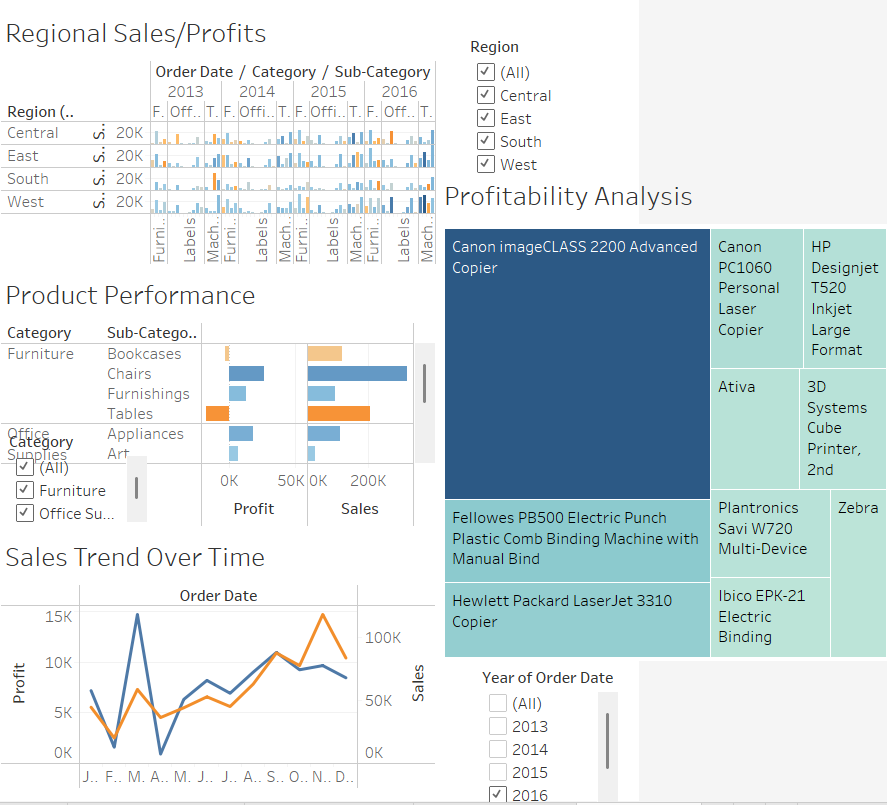

# 📈 Superstore Business Performance Analysis (Tableau)

This repository contains the Tableau Workbook and analysis for the CMT 426 - Business Intelligence and Analytics assignment.

## 🎯 Project Objectives

The primary goal of this analysis was to identify key patterns, strengths, and weaknesses in Superstore's business performance to deliver data-driven recommendations that support strategic expansion and operational improvements.

---

## ❓ Business Problem Statement

Superstore is seeking to expand and improve its operations. Before making strategic decisions, the company must evaluate which regions, product categories, and individual products are performing well in terms of sales and profitability.

---

## 🛠️ Data & Tools

* **Data Source:** Sample Superstore Dataset
* **Tools:** Tableau Desktop
* **File:** `Superstore_Analysis.twbx` (Tableau Packaged Workbook)

---
## 🖼️ Final Dashboard Overview

---
## 📊 Key Insights

### A. Regional Sales & Profit
* **East** and **West** regions consistently show higher sales volumes.
* The **South** region has significant profit losses, notably in sub-categories like Tables and Machines.
* The **Central** region is balanced but lacks significant growth
* 
### B. Sales Trends Over Time
* Sales and profits follow a **seasonal trend**, peaking during **Q3 and Q4** (especially September to December).
* Years like 2014 and 2015 showed sharper profit growth compared to 2013, which had uneven profitability.
* 
### C. Product Performance
* **Technology** products like **Copiers and Phones** are top performers in both sales and profitability.
* **Tables** in the **Furniture** category show high sales but **negative profits**, indicating potential issues with pricing or cost.
* No Furniture items appeared in the Top 10 most profitable products list.

---

## ✅ Business Recommendations

[cite_start]Based on the analysis, the following recommendations are provided[cite: 97, 100, 103, 105]:

| Recommendation | Strategy |
| :--- | :--- |
| **Prioritize High-Profit Products** | Focus marketing and inventory efforts on top-performing items like Copiers, Printers, and select Office Tech. Expand these product lines regionally. |
| **Investigate Unprofitable High-Sellers** | Products like **Tables** are unprofitable despite selling well[cite: 101]. [cite_start]Consider renegotiating supplier costs, raising prices, or phasing out low-margin items (SKUs). |
| **Boost South Region Strategy** | Address the repeated profit losses in the South region with a localized strategy focusing on operational efficiency, cost control, or tailored marketing. |
| **Leverage Seasonal Peaks** | Since Q4 shows a spike, plan major promotions, restocking, and campaigns ahead of the September to December window. |

